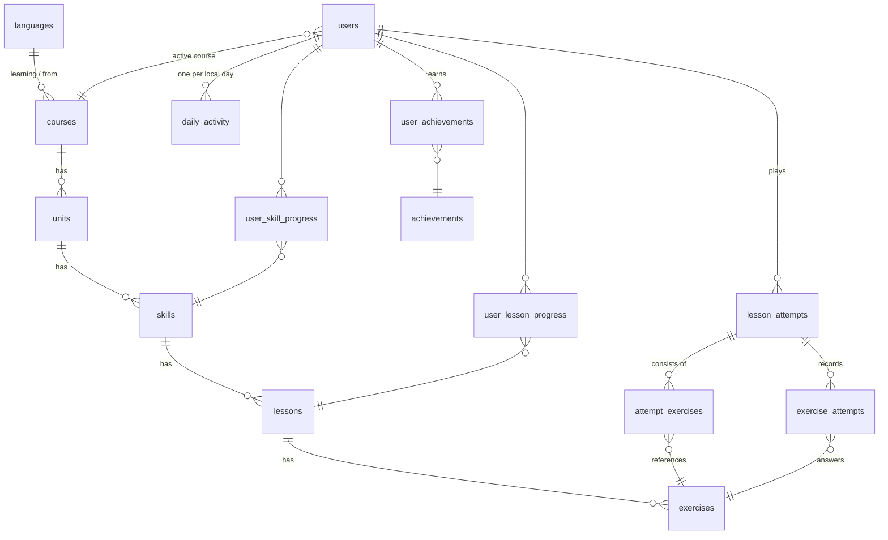

# Habla 🌱 — a gamified language-learning vertical slice

Habla is a Duolingo-inspired Spanish course built as a **production-style vertical slice**: a
learning path driven by real backend state, a reusable lesson engine, and server-authoritative
gamification (hearts, XP, streaks, daily goals, mastery, achievements, leaderboard).

**Live demo:** https://habla-web-one.vercel.app (API: https://habla-api-cyan.vercel.app/docs)

Everything visual is original: the mascot **Pip** is hand-written SVG, sounds are synthesised
with Web Audio, and there are no third-party image or audio assets.

> * Deeper design notes (ER model, state machine, API contract, gamification flow):
>   [`docs/ARCHITECTURE.md`](docs/ARCHITECTURE.md)

---

## Quick start

Prerequisites: **Python 3.11+** and **Node 20+**.

```bash
# 1. Backend
cd backend
python -m venv .venv && source .venv/Scripts/activate   # macOS/Linux: source .venv/bin/activate
pip install -r requirements-dev.txt                   # runtime + test tools (prod uses requirements.txt)
python -m app.seed.seed                               # creates habla.db with the demo course + learner
uvicorn app.main:app --port 8000                      # http://127.0.0.1:8000/docs for Swagger
```

```bash
# 2. Frontend (new terminal)
cd frontend
npm install
npm run dev                                           # http://localhost:3000
```

The frontend proxies `/api/*` to the backend (see `next.config.ts`), so there's no CORS setup and
no frontend env var needed for local work.

**Demo credentials:** none needed. Every request without an `X-User-Id` header acts as the seeded
learner **Alex (`demo`)**. Seeded state: Greetings completed, Food half-done, a 4-day streak
that's *at risk today*, 4/5 hearts, 535 gems, rank #5 this week. That way the first lesson you
finish visibly extends the streak, hits the daily goal and unlocks the next skill.

Re-run `python -m app.seed.seed` at any time to reset.

### Tests

Five layers. [`docs/REQUIREMENTS_CHECK.md`](docs/REQUIREMENTS_CHECK.md) maps every requirement to the test that proves it.

```bash
cd backend  && python -m pytest --cov=app   # 80 tests, 94% coverage: rules, properties (Hypothesis), API, concurrency, whole course
cd frontend && npm test                     # 21 tests: state machine, exercises, LessonPlayer integration
cd frontend && npm run typecheck && npm run build
```

End-to-end (Playwright, real browser, desktop **and** mobile, plus axe accessibility scans) runs against
the app while it's running:

```bash
cd frontend && npx playwright install chromium   # once
# with the backend on :8000 and the frontend on :3000 (ideally `npm run build && npm start`):
npm run e2e                                      # 21 scenarios × 2 viewports
```

---

## Features

| Area | What it does |
|---|---|
| **Learning path** | Units → skills rendered as a winding trail from backend data. Skill nodes show locked / available / in-progress / completed, a progress ring, and a **crown level (0–5)**. Popover lists lessons and starts the next one. |
| **Lesson engine** | 5 exercise types (multiple choice with pictures, fill-in-the-blank, word bank, match pairs, typed answer) plugged in via a registry. Missed exercises come back at the end. Refreshing mid-lesson resumes exactly where you were. |
| **Feedback** | Bottom action bar: Check → correct (praise, combo, flying +XP) or incorrect (shake, correct answer, explanation). Enter and number keys work throughout. |
| **Hearts** | −1 per mistake in lessons, persisted immediately. At zero: refill with gems, earn one through practice, or end the lesson. |
| **XP / levels / gems** | Exercise XP + completion bonus + perfect bonus, credited atomically at completion. Levels derive from total XP. |
| **Streak & daily goal** | Calculated on the learner's *local* calendar (timezone auto-detected). A streak "at risk" banner appears when you practised yesterday but not yet today. |
| **Smart practice** | Builds a session from exercises you've missed more often than you've got right. Never costs hearts and earns one back. |
| **Mistake review** | After a session: "You said / Correct / why" for every missed exercise. |
| **Achievements** | Data-driven (`metric ≥ threshold` rows). Unlocks appear on the completion screen; locked ones show progress. |
| **Leaderboard** | Weekly (rolling 7 days, from activity data) and all-time, with the current learner highlighted and pinned if outside the top list. |
| **Profile & settings** | Level progress, stats grid, achievements, 7-day momentum chart; daily goal / name / sound settings; account/notification placeholders. |
| **Quests & Shop** | Daily quests derived from real activity (XP, lessons, streak). The shop refills hearts with (mocked) gems; Super and Streak Freeze are "coming soon". |
| **Demo tools** | Settings → *Next day* / *Skip a day* / *Reset demo* make the day-based rules (streak, daily goal) demonstrable without waiting for midnight. |
| **Resilience** | Skeletons, specific error messages with retry, answer kept on network failure, completion retry that can't double-award, 404 page. |
| **Responsive & a11y** | Bottom tab bar on mobile and a sidebar plus right rail on desktop. Touch-sized tiles, semantic buttons/radios, visible focus rings, aria-live feedback, reduced-motion support, no colour-only states (icons/text accompany colour). |

---

## Tech stack

* **Frontend:** Next.js 15 (App Router) · React 19 · TypeScript (strict) · Tailwind CSS · TanStack Query · Vitest + Testing Library
* **Backend:** Python · FastAPI · Pydantic v2 · SQLAlchemy 2.0 · SQLite (WAL, FKs enforced) · pytest

---

## Architecture

```
Browser ── Next.js ──(/api rewrite)──► FastAPI
                                        routes        thin: validate (Pydantic) → service → schema
                                        services      business rules; one transaction per use case
                                          ├ exercises/   handler registry: check + redact per type
                                          ├ streak.py    pure date logic
                                          ├ rewards.py   pure XP/gem/level math
                                          └ unlocks.py   pure unlock/mastery derivation
                                        repositories  SQLAlchemy queries only
                                        models        ORM
                                                        ▼
                                                      SQLite
```

### Folder structure

```
backend/app/
  api/deps.py, api/routes/        me · path · sessions (lessons/attempts/practice) · leaderboard
  core/                           config (GameRules), clock (timezones), domain errors
  db/                             engine/session, declarative base
  models/                         content.py (course tree) · learner.py (progress, sessions, activity)
  schemas/                        response/request models (no solution fields in public schemas)
  repositories/                   content.py · progress.py
  services/                       session_service · path_service · learner_service · practice_service
                                  achievement_service · leaderboard_service · streak · rewards · unlocks
  services/exercises/             registry.py · handlers.py · normalize.py
  seed/                           builders.py (exercise DSL) · course_spanish.py (content) · seed.py
backend/tests/                    answer validation · pure domain rules · end-to-end lesson flow

frontend/src/
  app/                            (main)/ learn · leaderboard · profile · settings   lesson/[id] · practice
  features/lesson/                lessonMachine.ts (pure reducer) · useLesson.ts (effects)
  components/exercises/           registry.ts + one component per type
  components/lesson/              LessonPlayer · Header · ExerciseRenderer · FeedbackBar · Complete · modals
  components/path/                LearningPath · SkillNode · theme
  components/gamification/        DailyGoalCard · PracticeCard · ActivityCard
  components/profile/, layout/, ui/
  lib/                            api.ts (typed client + ApiError) · queries.ts (cache keys/hooks) · types.ts · sfx.ts
```

---

## Database schema



**Content** (`languages → courses → units → skills → lessons → exercises`) is shared and holds no
learner state. Ordering uses `position` with `UNIQUE(parent_id, position)`. `exercises.data` is the
public render payload and `exercises.solution` is the private answer key. Both are JSON, validated per
`type` by the handler's Pydantic models when the seed writes them.

**Learner state:**

* `users`: profile plus counters mutated only inside service transactions (`hearts`, `gems`,
  `total_xp`, streak fields, `daily_goal_xp`, `timezone`). `CHECK` constraints keep hearts and gems ≥ 0.
  `total_xp` is a deliberate denormalised counter for leaderboard and level reads.
* `lesson_attempts`: one play session (`lesson` or `practice`), with status and a **reward receipt**.
  It's the idempotency key for completion.
* `attempt_exercises`: the ordered exercise set of a session. Lessons and practice share one code path.
* `exercise_attempts`: append-only answer history. It feeds mistake review, weak-area practice and
  "perfect lesson".
* `user_lesson_progress`: times completed per lesson. **Unlocks and mastery are derived from it.**
* `user_skill_progress`: skill XP and *when* the skill was first completed (a historical fact).
* `daily_activity`: `UNIQUE(user_id, activity_date)` on the learner's local date. It powers the
  daily goal, momentum chart and weekly leaderboard.
* `achievements` / `user_achievements`: data-driven definitions; a unique pair prevents double unlocks.

**Why isn't progress on the `skills` table?** Skills are shared content. Per-learner progress there
would make it a single-user app, and storing "unlocked" at all would duplicate what completions
already imply.

Indexes cover the hot paths: attempts by `(user, status)` and `(user, lesson)`, answers by
`(attempt, exercise)` and `(user, is_correct)`, `daily_activity.activity_date`, `users.total_xp`.

---

## API

All under `/api`. Interactive docs live at `http://127.0.0.1:8000/docs`. Errors share one envelope:
`{"error": {"code": "lesson_locked", "message": "…"}}`.

| Method | Path | Notes |
|---|---|---|
| GET | `/me` | HUD: hearts, gems, XP, level, effective streak, today's goal, momentum |
| GET | `/me/stats` · `/me/activity` | Profile stats + achievements · last 7 days + recent sessions |
| PATCH | `/me/settings` | `{daily_goal_xp?, timezone?, display_name?}`; 400 `invalid_daily_goal` / `invalid_timezone` |
| POST | `/me/hearts/refill` | 402 `insufficient_gems`, 409 `hearts_full` |
| GET | `/path` · `/skills/{id}` | Course tree with derived state |
| POST | `/lessons/{id}/start` | Start **or resume**. 403 `lesson_locked` / `out_of_hearts`, 404 `lesson_not_found` |
| GET | `/attempts/{id}` | Resume a session |
| POST | `/attempts/{id}/answers` | See below. 409 `out_of_order` / `attempt_closed`, 422 `invalid_answer`, 403 `out_of_hearts` |
| POST | `/attempts/{id}/complete` | **Idempotent.** 409 `session_incomplete` |
| POST | `/attempts/{id}/abandon` | Quit / out of hearts → `abandoned` / `failed` |
| GET | `/attempts/{id}/review` | Mistakes with your answer + solution; 409 while in progress |
| GET | `/practice/summary` · POST `/practice/start` | Smart practice |
| GET | `/leaderboard?period=week\|all` | 422 for other periods |
| POST | `/dev/time-travel` · `/dev/reset` | Demo tools: `{days}` shifts the learner's history back (= days passing); reset re-seeds. Disable with `HABLA_ENABLE_DEV_TOOLS=false` |

```jsonc
// POST /api/attempts/42/answers
{ "exercise_id": 17, "answer": { "tile_ids": ["t1", "t4", "t0"] } }

// 200
{
  "correct": false,
  "correct_answer": "Yo bebo agua",
  "note": null,
  "explanation": "“Bebo agua” alone is also fine – the verb already says “I”.",
  "detail": null,
  "xp_earned": 0,
  "hearts_remaining": 3,
  "out_of_hearts": false,
  "requeued": true,
  "progress": { "completed": 2, "total": 5 },
  "next_exercise_id": 18
}
```

Answer payloads per type: `{option_id}` (multiple_choice, fill_blank) · `{tile_ids: []}` (word_bank)
· `{pairs: {left_id: right_id}}` (match_pairs) · `{text}` (type_answer).

```jsonc
// POST /api/attempts/42/complete  (a second call returns the same body with "already_completed": true)
{
  "xp": { "base": 29, "bonus": 5, "total": 34 }, "gems_awarded": 5, "perfect": false, "mistakes": 1,
  "streak": { "current": 5, "longest": 5, "extended": true },
  "daily_goal": { "goal_xp": 20, "xp_today": 34, "reached": true, "just_reached": true },
  "level": { "level": 3, "xp_into_level": 62, "xp_for_next_level": 150, "leveled_up": false },
  "skill": { "title": "Food", "lessons_completed": 2, "lessons_total": 2, "mastery": 1, "just_completed": true, … },
  "unlocked_skill": { "id": 3, "title": "Animals", "icon": "🐶" },
  "achievements": [], "already_completed": false, …
}
```

---

## Design decisions (the interview questions)

**Why is answer validation on the backend?** Public exercise schemas contain no solution, so the
browser never has the answer key. `POST /answers` loads the exercise, validates the payload with the
type's Pydantic `AnswerModel` (unknown option ids, reused tiles and incomplete boards get a 422 and
cost nothing), checks it, records the attempt and adjusts hearts. The client only renders the response.
Match-pairs is checked as a whole board for the same reason: checking each tap on the client would
ship the key, and checking each tap on the server would let a client probe it.

**How does a new exercise type get added?** Backend: one `ExerciseHandler` subclass (data / solution /
answer models + `check` + `describe_*`), decorated with `@register`. Frontend: one component and one
entry in `components/exercises/registry.ts` (component, kicker, `isReady`). The lesson player, state
machine, API, DB schema and session logic don't change. `ExerciseRenderer` even degrades gracefully
for an unknown type.

**Why is lesson progression centralised?** The *queue* lives on the server: `next_exercise_id` is
derived from recorded answers (unseen first, then missed ones in least-recently-missed order). That
makes resume-after-refresh free, stops clients from skipping or replaying exercises (409
`out_of_order`), and lets completion be verified ("every exercise answered correctly"). The client's
*interaction* state is one pure reducer (`lessonMachine.ts`, unit-tested) with phases
`loading → answering → checking → feedback → completing → completed`, plus `out_of_hearts`,
`failed` and `error`. Side effects live only in `useLesson`.

**How is duplicate XP prevented?** XP isn't credited per answer (`xp_earned` is provisional). It's
credited once, at completion, inside a single transaction that starts with a compare-and-set:
`UPDATE lesson_attempts SET status='completed' WHERE id=? AND status='in_progress'`. Exactly one
request gets rowcount 1 and applies rewards. Duplicates (double-click, retry after a timeout, a second
tab) get the stored receipt with `already_completed: true`. Tested in `test_duplicate_completion_is_idempotent`.

**How are transactions handled?** One request = one session (`get_db`). Each write use case commits
once at the end. Completion flips the status and updates XP, gems, hearts, daily activity, streak,
lesson/skill progress and achievements, then commits together or rolls back together, so "XP awarded
but lesson not completed" can't happen. Hearts use an atomic floor-guarded
`UPDATE … SET hearts = hearts - 1 WHERE hearts > 0`.

**How is the streak calculated?** `services/streak.py` is pure: `apply_activity(state, today)` and
`effective_streak(state, today)`. "Today" comes from `local_today(now, user.timezone)`, and `now` is an
injected dependency, so tests move the clock instead of patching `datetime`. A broken streak is only
rewritten on the next activity, so reads use `effective_streak` to show 0 after a missed day. Moving
west across timezones (date going backwards) never penalises or double-counts.

**How is skill unlocking determined?** `services/unlocks.py` derives everything from
`user_lesson_progress`: the first skill is open, and each next skill opens when the previous one has
every lesson completed. Lesson N opens after lesson N−1. Mastery is full passes over the skill, capped at
5. Nothing is stored, so state can't drift and reordering content needs no migration. `start_lesson`
enforces the same rule server-side (403 `lesson_locked`).

**How is server state separated from UI state?** Server state lives only in TanStack Query
(`lib/queries.ts`, one key registry). After an answer, the cached learner's `hearts` is patched with
`setQueryData`, so there's no refetch. After completion, the affected queries (`me`, `path`, `stats`,
`activity`, `practice`, `leaderboard`) are invalidated once. Draft answers, the selected match tile,
modals and animations are local (reducer or component state). `localStorage` holds only the
sound-mute preference.

**How would this scale beyond SQLite?** Swap `HABLA_DATABASE_URL` for Postgres (no SQLite-only SQL;
the CAS completion and atomic heart decrement are portable) and add Alembic migrations. The weekly
leaderboard would move to a Redis sorted set or a materialised table updated on completion. Content
is read-mostly and cacheable per course version.

**How would authentication be added?** Every route already gets the learner through one dependency,
`get_current_user` (`api/deps.py`). Replace its `X-User-Id`/demo fallback with session-cookie or JWT
verification. Services already take a `User` and check ownership (another learner's attempt returns 404).

**How would another language be added?** Write a content module shaped like `seed/course_spanish.py`
using the builder DSL, plus `languages`/`courses` rows. The frontend renders whatever `/path`
returns. Unit themes and flags are data-keyed.

---

## Deployment

### Option A (recommended, free, no card): Vercel + Neon Postgres

Two Vercel projects from this one repo, plus Vercel's free Neon Postgres integration:

| Vercel project | Root directory | What Vercel does |
|---|---|---|
| `habla-api` | `backend` | Detects FastAPI (`app/main.py`) and runs it as a Python function |
| `habla-web` | `frontend` | Builds Next.js; `/api/*` is proxied to `habla-api` |

1. **API:** import the repo, set root directory `backend`. In the project's **Storage** tab, create a
   **Neon** Postgres database and connect it. That injects `DATABASE_URL`. Deploy; the API seeds the
   empty database on first boot (an advisory lock makes this safe if several instances start at once).
2. **Web:** import the repo again, set root directory `frontend`, and add
   `HABLA_API_ORIGIN=https://<habla-api-domain>` *before* deploying (Next bakes rewrites in at build time).

**Why Postgres in the hosted demo when the project uses SQLite?** Serverless functions have no
persistent disk, so a SQLite file would reset on every cold start and differ between instances. The
code is unchanged: SQLAlchemy plus one environment variable. The whole backend suite runs green on both
engines (`HABLA_TEST_DATABASE_URL=postgresql+psycopg://… pytest`), and the E2E suite passes against a
Postgres-backed stack. psycopg's server-side prepared statements are disabled so Neon's pooled
(PgBouncer) URL works.

### Option B: one Docker container (any Docker host)

The root [`Dockerfile`](Dockerfile) builds frontend **and** backend into one image: Next.js on port 7860
proxies `/api` to FastAPI on `127.0.0.1:8000` ([`deploy/start.sh`](deploy/start.sh)), with SQLite inside
the container.

```bash
docker build -t habla . && docker run -p 7860:7860 habla     # http://localhost:7860
```

### Option C: Render (API) + Vercel (web)

[`render.yaml`](render.yaml) is a Render Blueprint for the API (SQLite on the instance disk, re-seeded on
restart). Choose the *Free* instance type, or create a plain *Web Service* with root `backend` and start
command `uvicorn app.main:app --host 0.0.0.0 --port $PORT`. Then deploy the frontend to Vercel as above.

Environment variables (all optional locally):

| Variable | Default | Purpose |
|---|---|---|
| `HABLA_DATABASE_URL` / `DATABASE_URL` | `sqlite:///backend/habla.db` | SQLAlchemy URL; `postgres://…` is accepted (driver added automatically) |
| `HABLA_AUTO_SEED` | `true` | Seed when the DB has no learners |
| `HABLA_ENABLE_DEV_TOOLS` | `true` | `/api/dev/*` demo endpoints |
| `HABLA_CORS_ORIGINS` | localhost:3000 | Only needed if the browser calls the API directly |
| `HABLA_API_ORIGIN` (frontend) | `http://127.0.0.1:8000` | Where Next proxies `/api` |

Free Render instances sleep when idle. The first request after a while can take ~50s; the UI
shows "Can't reach Habla" with a retry button meanwhile. Their disk is ephemeral, so the demo
data resets on restart (and re-seeds automatically).

## Assumptions & trade-offs

* **Single demo identity** rather than auth flows, as the brief said not to over-engineer authentication.
* **XP is credited at completion only.** Abandoning a lesson forfeits its XP (but practice history
  still counts toward weak-area detection). The per-answer `xp_earned` is shown as provisional.
* **Hearts don't regenerate over time.** The brief allows "over time *or* via practice/refill"; Habla
  uses practice (+1 heart, free) and a gem refill (the seed simulates one overnight heart).
* **Crowns** are the UI name for the backend's `mastery` field: crown level N = every lesson in the skill
  completed N times.
* **Typed answers** forgive case, whitespace and punctuation (including ¿ ¡), and accept missing
  accents *with a note*. Spelling mistakes are wrong. `ñ` is treated as a letter, not an accented n.
* **Weekly leaderboard** is a rolling 7 days rather than calendar weeks, so it's never empty on Mondays.
* **Practice XP** includes exercise XP plus a small bonus. Practice earns a heart instead of gems.
* Types in `lib/types.ts` are hand-mirrored from Pydantic schemas; at scale they'd be generated from OpenAPI.

## Future improvements

Listening / speaking exercises (the registry is ready; `SpeakButton` already does TTS), spaced
repetition for practice scheduling, timed heart regeneration, real auth + friends leagues,
Alembic migrations, OpenAPI-generated client types, Playwright end-to-end tests, and an offline
answer queue.
